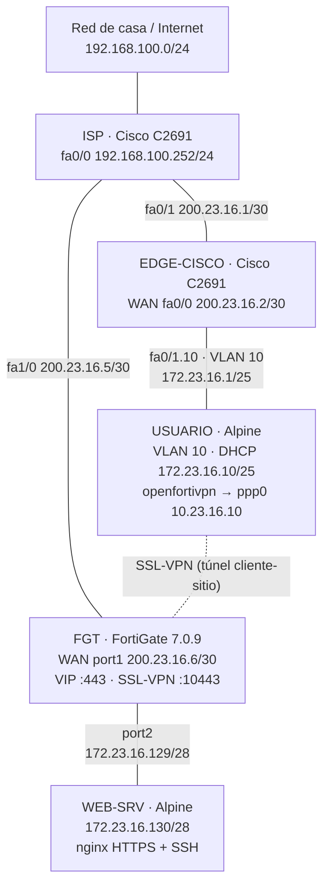
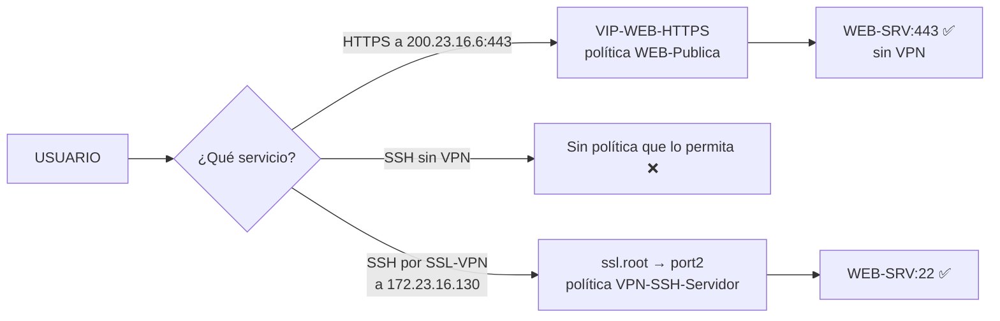

# Infraestructura 3 — Web publicada y SSH por VPN de acceso remoto (SSL-VPN)

**Estudiante:** Abdul Djalo · **Matrícula:** 2023-1600

## 1. Propósito

Publicar un **servidor web HTTPS** para que el usuario pueda acceder a él **sin VPN**, y permitir el acceso administrativo por **SSH únicamente a través de una VPN de acceso remoto** (cliente a sitio) entre el PC del usuario y el FortiGate. El laboratorio demuestra cómo separar un servicio público de uno restringido usando una IP virtual (VIP) y una SSL-VPN.

## 2. Objetivos

- El usuario accede al servidor web (HTTPS) **sin necesidad de VPN**.
- El usuario accede al servidor por **SSH solamente a través de la VPN**.
- Configurar la red y la VPN de acceso remoto del FortiGate por GUI.
- Configurar la red del equipo Cisco (VLAN 10, DHCP y NAT).
- Simular un ISP con direcciones IP públicas.
- Comprobar el camino con traceroute hacia el servidor.

## 3. Topología

### 3.1 Topología en PNetLab


### 3.2 Diagrama lógico



### 3.3 Flujos de acceso al servidor



## 4. Equipos

| Nodo | Imagen | Recursos | Función |
|---|---|---|---|
| ISP | Cisco C2691 (Dynamips, IOS 12.4) + NM-1FE-TX | por defecto | Router del proveedor con IP públicas |
| EDGE-CISCO | Cisco C2691 (Dynamips, IOS 12.4) | por defecto | Equipo de red del sitio del usuario |
| FGT | FortiGate-VM 7.0.9 | 1 vCPU, 1 GB RAM | Firewall del sitio del servidor, VIP y SSL-VPN |
| USUARIO | Alpine Linux 3.20 + openfortivpn 1.24.1 | 1 vCPU, 256 MB | Cliente en VLAN 10 y cliente VPN |
| WEB-SRV | Alpine Linux 3.20 | 1 vCPU, 256 MB | nginx HTTPS y OpenSSH |

## 5. Direccionamiento

| Equipo | Interfaz | Dirección |
|---|---|---|
| ISP | fa0/0 / fa0/1 / fa1/0 | 192.168.100.252/24 · 200.23.16.1/30 · 200.23.16.5/30 |
| EDGE-CISCO | fa0/0 (WAN) | 200.23.16.2/30 |
| EDGE-CISCO | fa0/1.10 (VLAN 10) | 172.23.16.1/25 (DHCP .10 – .120) |
| FGT | port1 (WAN) | 200.23.16.6/30 |
| FGT | port2 (SERVIDORES) | 172.23.16.129/28 |
| FGT | Pool SSL-VPN | 10.23.16.10 – 10.23.16.20 |
| USUARIO | eth0.10 / ppp0 | DHCP 172.23.16.10 / 10.23.16.10 (VPN) |
| WEB-SRV | eth0 | 172.23.16.130/28 |

## 6. Configuración

### 6.1 ISP y EDGE-CISCO (CLI)

El ISP tiene la misma configuración de las infraestructuras anteriores. EDGE-CISCO solo hace **configuración de red**: WAN, sub-interfaz `fa0/1.10` para la VLAN 10, DHCP y NAT para que el usuario salga a Internet y alcance la IP pública del FortiGate. A diferencia de la Infraestructura 2, **no hace VPN**: el túnel lo establece el PC del usuario, y por el Cisco ya pasa cifrado.

Comandos: [`scripts/isp-config.txt`](scripts/isp-config.txt), [`scripts/edge-cisco-config.txt`](scripts/edge-cisco-config.txt)

### 6.2 FortiGate: red (GUI)

Bootstrap por consola (IP de port1, acceso y ruta por defecto) y el resto por GUI: hostname `FGT`, port1 como `WAN` y port2 como `SERVIDORES` (172.23.16.129/28), y la política `SRV-a-Internet` con NAT.

En la WAN se dejó el acceso administrativo **solo por HTTP y PING**. Así el puerto 443 queda libre para la web publicada, y el FortiGate no responde a SSH desde Internet.


### 6.3 FortiGate: publicación de la web (objetivo 1)

- **Virtual IP `VIP-WEB-HTTPS`:** 200.23.16.6:443 → 172.23.16.130:443 (TCP, port forwarding).
- **Política `WEB-Publica`:** WAN (port1) → SERVIDORES (port2), origen `all`, destino `VIP-WEB-HTTPS`, **servicio solo HTTPS**, sin NAT.


### 6.4 FortiGate: SSL-VPN de acceso remoto (objetivo 2)

| Elemento | Configuración |
|---|---|
| Rango de clientes | Objeto `SSLVPN-POOL`: 10.23.16.10 – 10.23.16.20 |
| Usuario / grupo | Usuario local `vpnuser`, grupo `VPN-USUARIOS` |
| Portal | `full-access`: tunnel mode, split tunneling por destino de política, *routing address override* `port2 address`, pool `SSLVPN-POOL` |
| SSL-VPN Settings | Interfaz WAN (port1), **puerto 10443** (el 443 lo usa la VIP), acceso desde cualquier host, mapping `VPN-USUARIOS` → `full-access` |
| Política `VPN-SSH-Servidor` | ssl.root → SERVIDORES (port2), origen `SSLVPN-POOL` + `VPN-USUARIOS`, destino `port2 address`, **servicios SSH, PING y TRACEROUTE**, sin NAT |


**Resumen de políticas:**

| Política | Recorrido | Servicios |
|---|---|---|
| SRV-a-Internet | port2 → port1 | ALL (con NAT) |
| WEB-Publica | port1 → port2 (VIP) | HTTPS |
| VPN-SSH-Servidor | ssl.root → port2 | SSH, PING, TRACEROUTE |

### 6.5 WEB-SRV

nginx con HTTPS (certificado autofirmado) y OpenSSH, con el usuario `abdul` para las pruebas.

Script: [`scripts/websrv-setup.sh`](scripts/websrv-setup.sh)

### 6.6 USUARIO: cliente VPN

VLAN 10 por DHCP del Cisco y el cliente libre **openfortivpn** (FortiClient no existe para Alpine). En Alpine 3.20 el paquete solo está en el repositorio `edge/testing`.

```
openfortivpn 200.23.16.6:10443 -u vpnuser -p '<CLAVE>' \
  --trusted-cert 286efc05555bc05560acbbb14928b35b93b7da0e6a47e1a6701bc983704f1190 \
  --insecure-ssl --min-tls=1.0 --cipher-list "ECDHE-RSA-AES256-SHA:@SECLEVEL=0"
```

Script: [`scripts/usuario-setup.sh`](scripts/usuario-setup.sh)

## 7. Pruebas y resultados

### 7.1 Sin VPN

```
USUARIO:~# wget --no-check-certificate -T 5 -qO- https://200.23.16.6
<h1>WEB-SRV - Infraestructura 3 - Abdul Djalo 2023-1600</h1>

USUARIO:~# ssh -o ConnectTimeout=5 abdul@200.23.16.6
ssh: connect to host 200.23.16.6 port 22: Operation timed out
```

La web se ve a través de la IP pública, pero el SSH no pasa: la única política desde Internet permite solo HTTPS, y la IP privada del servidor no es alcanzable sin túnel.


### 7.2 Conexión de la VPN

```
INFO:   Connected to gateway.
INFO:   Authenticated.
INFO:   Remote gateway has allocated a VPN.
INFO:   Got addresses: [10.23.16.10], ns [0.0.0.0, 0.0.0.0]
INFO:   Interface ppp0 is UP.
INFO:   Setting new routes...
INFO:   Tunnel is up and running.
```


### 7.3 Con VPN

```
USUARIO:~# ping -c 3 172.23.16.130
64 bytes from 172.23.16.130: seq=0 ttl=63 time=121.021 ms
64 bytes from 172.23.16.130: seq=1 ttl=63 time=56.012 ms

USUARIO:~# ssh abdul@172.23.16.130
abdul@172.23.16.130's password:
Welcome to Alpine!
WEB-SRV:~$
```

El `ttl=63` indica un único salto: el tráfico entra por el túnel directamente al FortiGate, sin que el Cisco ni el ISP aparezcan en el camino lógico.


| Prueba | Sin VPN | Con VPN |
|---|---|---|
| HTTPS a 200.23.16.6 | ✅ | ✅ |
| SSH a 200.23.16.6 | ❌ timeout | — |
| SSH a 172.23.16.130 | ❌ timeout | ✅ |
| Ping a 172.23.16.130 | ❌ | ✅ ttl=63 |

## 8. Limitaciones y decisiones del entorno

- **TLS 1.0 en la SSL-VPN:** el FortiGate en evaluación solo negocia **TLS 1.0** (comprobado con `openssl s_client`). El cliente necesitó `--insecure-ssl`, `--min-tls=1.0` y el cifrado `ECDHE-RSA-AES256-SHA` con `@SECLEVEL=0`. **En producción se usaría TLS 1.2/1.3 con un certificado firmado por una CA de confianza.**
- **Certificado de fábrica:** se aceptó explícitamente con `--trusted-cert` y su huella SHA-256.
- **Un solo portal:** la licencia de evaluación solo incluye el portal `full-access`, así que se configuró ese portal en modo túnel.
- **Puerto 10443:** el 443 está ocupado por la VIP de la web publicada.
- **Router c2691 como equipo de red:** el c7200 se apagaba al cursar tráfico sostenido con NAT, así que se sustituyó por un c2691, suficiente porque en esta infraestructura el Cisco no hace VPN.
- **Cliente openfortivpn desde edge/testing:** no está en los repositorios estables de Alpine 3.20.
- **GUI por HTTP y bootstrap por CLI:** igual que en las infraestructuras anteriores.

## 9. Archivos

| Carpeta | Contenido |
|---|---|
| [`configs/`](configs/) | `FGT.conf`, `EDGE-CISCO-running-config.txt`, `ISP-running-config.txt`, archivos de los Alpine |
| [`scripts/`](scripts/) | `isp-config.txt`, `edge-cisco-config.txt`, `usuario-setup.sh`, `websrv-setup.sh` |
| [`imagenes/`](imagenes/) | Capturas de configuración y pruebas |
| [`diagramas/`](diagramas/) | Diagramas de la topología |
